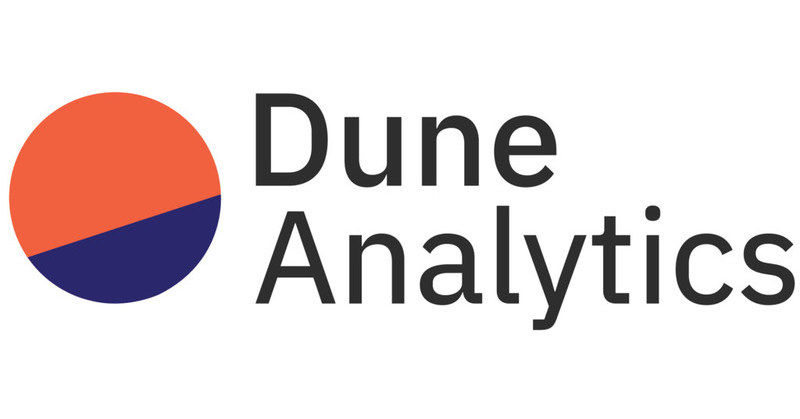

A python library where you can download the data of the queries that you created in Dune Analytics.

Built using Duneanalytics and Python.

## How does it work?
The library can be used to fetch the table data from python backend, doesn't run the query.

The original [repository](https://github.com/itzmestar/duneanalytics).

To see some queries examples you can visit my [dashboards](https://dune.com/datactuary) page.

## Authors 👦
- Matias Rodriguez ([@rodriguezmatid](https://twitter.com/rodriguezmatid))

## Contributing ✅
PRs and issues are always welcome. Feel free to submit any issues or ideas you have at the [issues page](https://github.com/rodriguezmatid/Dune-Analytics/issues).